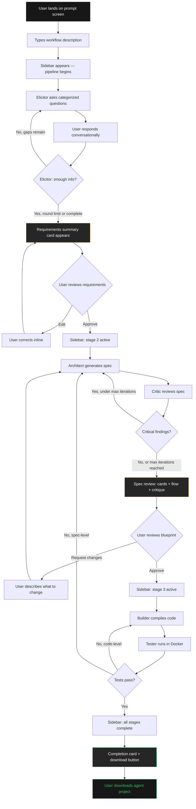
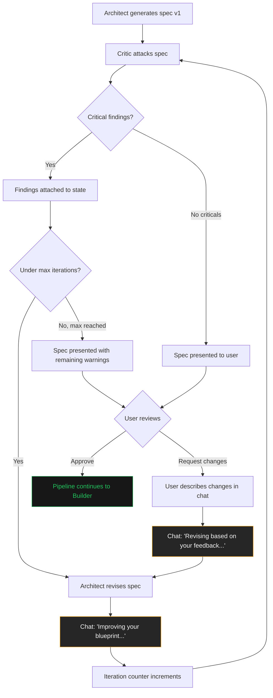
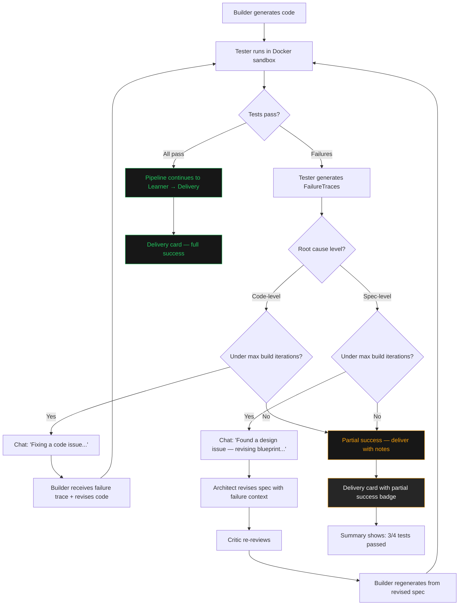

# UX Design Specification: Frankenstein

**Author:** Ved
**Date:** 2026-05-14

---

## Executive Summary

### Project Vision

Frankenstein is a meta-agentic system that lets domain experts — people who know their workflow but don't write code — build production-grade AI agent pipelines through natural language conversation. The user describes what they need, Frankenstein asks targeted questions, designs the architecture, stress-tests it, builds it, runs it, and delivers working code. Today these users file tickets with engineering teams and wait weeks. Frankenstein replaces that with a single conversation.

### Target Users

- **Primary:** Domain experts in enterprise settings — loan officers, compliance officers, supply chain managers, analysts
- **Tech level:** Moderate. Comfortable with enterprise tools and data, but not developer tools or code
- **Context:** Desktop/laptop, focused work sessions. "Sit down, describe a workflow, walk away with a working agent"
- **Motivation:** Speed and power. They want the same quality output an engineering team delivers, but without the weeks-long ticket cycle
- **Usage pattern:** Primarily one-shot builds. May return for new agents, but each session should produce a complete, working result

### Key Design Challenges

1. **Abstraction gap:** Users think in business workflows and rules. The system thinks in agents, tools, and specs. The UI must bridge this without overwhelming or oversimplifying
2. **Autonomous phase trust:** After the second human checkpoint, the pipeline runs autonomously (build, test, learn). Users need visibility and confidence during stages they don't control
3. **Elicitor conversation quality:** The Q&A must feel like a smart colleague asking the right questions — not a form. Shallow answers lead to weak agents, so the UX must encourage depth without friction

### Design Opportunities

1. **Spec review as a power moment:** Present the architectural blueprint as a visual agent flow diagram with plain-language role descriptions and inline critique annotations — not raw YAML. This is where users feel ownership and control
2. **Speed as a visible feature:** Pipeline runs in minutes. The UI should make progress tangible — real-time stage transitions, clear indicators of what's happening and why
3. **One-shot confidence:** The Elicitor must be thorough enough that users don't encounter preventable failures. Better to ask one more question than rebuild

## Core User Experience

### Defining Experience

The core experience is a single, continuous conversation. The user opens Frankenstein, types what they need, answers a few sharp questions, reviews a visual blueprint, approves it, and receives working agent code. There are no dashboards, configuration panels, or multi-step wizards. The conversation IS the interface — every interaction from input to delivery happens within it.

The two most critical interactions: (1) the Elicitor Q&A, where quality of user answers directly determines quality of output, and (2) the spec review checkpoint, where trust is built or broken.

### Platform Strategy

- **Platform:** Web application (React frontend, FastAPI backend)
- **Device:** Desktop/laptop only. This is focused, sit-down work
- **Input:** Mouse and keyboard. Primary interaction is typing natural language
- **Connectivity:** Online only. Requires real-time communication with backend pipeline
- **No mobile, no offline, no native app** — scope is intentionally tight

### Effortless Interactions

- **Starting a build:** Type one sentence describing what you want. No signup flows, no project setup, no template selection. Just a prompt box
- **Answering Elicitor questions:** Questions arrive in natural conversation flow, not as a checklist. User responds conversationally. The system extracts structure from natural language — the user never fills fields
- **Spec understanding:** The architectural blueprint renders as a visual agent flow with plain-language descriptions, not YAML or technical schemas. Critique findings appear as inline annotations with severity colors
- **Code delivery:** One-click download of the complete, working agent project

### Critical Success Moments

1. **"It understood me"** — When the Elicitor's questions reveal that the system grasped the user's domain and workflow. The user thinks: "this is asking the right questions"
2. **"This is real architecture"** — When the spec review shows a thoughtful agent design with roles, tools, and flow that matches how the user thinks about their workflow. Not a toy — a real blueprint
3. **"It actually works"** — When the downloaded agent code runs and produces meaningful output. The gap between "I described a workflow" and "I have working agents" closes in minutes

### Experience Principles

1. **Conversation is the product.** The entire UX is one continuous conversation. No mode switches, no navigation, no context breaks
2. **Questions must earn answers.** Every Elicitor question should make the user think "good question." If it feels like a form, we failed
3. **The blueprint is the trust moment.** Spec review translates architecture into language the user owns. Understanding = trust = approval
4. **Invisible complexity.** All friction lives behind the scenes. The user's experience is: talk, review, approve, download

## Desired Emotional Response

### Primary Emotional Goals

- **Empowerment:** "I can build this myself without an engineering team." The user feels capable and self-sufficient — not dependent on others to turn their expertise into working software
- **Confidence:** "This system knows what it's doing." From the first question the Elicitor asks, the user senses competence. By spec review, they trust the system's engineering judgment
- **Accomplishment:** "I just built a real agent system." The gap between intent and working code closes in one session. The user walks away having done something that previously required a team and weeks of work

### Emotional Journey Mapping

| Stage | Target Emotion | Design Implication |
|-------|---------------|-------------------|
| **First prompt** | Curiosity tempered by skepticism | Low-friction entry. No barriers between "I want to try this" and typing a prompt. Let the product prove itself |
| **Elicitor Q&A** | Growing confidence | Questions must feel sharp and domain-aware. Each question earns trust. "This system understands my world" |
| **Requirements review** | Ownership | User sees their knowledge reflected back in structured form. "Yes, that's exactly what I meant" |
| **Spec review** | Power + control | Visual blueprint in plain language. User feels like they're reviewing an architect's plan, not reading code. Critique findings show rigor |
| **Autonomous build** | Anticipation + trust | Real-time progress. User sees stages complete. No anxiety — clear visibility into what's happening |
| **Code delivery** | Accomplishment + pride | Clean download. Working code. The moment that justifies the whole experience |
| **Error/retry** | Calm reassurance | System is fixing itself. User sees what happened and what's being corrected. Never panic, never confusion |

### Micro-Emotions

- **Confidence over confusion** — The user must never feel lost. Every screen state, every transition, every piece of information should reinforce "you're on track"
- **Trust over skepticism** — Won during spec review. The blueprint must feel thorough and real, not generated fluff. Critique findings prove the system challenged its own work
- **Accomplishment over frustration** — One-shot success is the target. If the system needs to retry, frame it as rigor ("testing and improving") not failure

### Design Implications

- **Empowerment → Minimal UI chrome.** The user's words drive everything. The interface stays out of the way and lets their input be the center of attention
- **Confidence → Progressive disclosure.** Show competence through behavior (smart questions, thorough spec) not through UI claims or marketing copy
- **Trust → Transparency during autonomy.** When the user isn't in control (build/test phase), give them a window into what's happening. Stage indicators, not spinners
- **Accomplishment → Clear completion.** The final delivery should feel like a moment — not buried in a log. Clean presentation of what was built, what it does, and how to run it

### Emotional Design Principles

1. **Earn trust through demonstrated competence.** Don't tell users the system is smart — show them through the quality of questions asked and specs generated
2. **Never leave the user in the dark.** Every stage has visible progress. Every decision has a reason. Uncertainty breeds anxiety
3. **Frame iteration as rigor, not failure.** When the pipeline retries, the messaging is "testing and improving your agents" — not "something went wrong"
4. **The finish line should feel like a finish line.** Code delivery is an event, not a log entry. The user should feel the weight of what they accomplished

## UX Pattern Analysis & Inspiration

### Inspiring Products Analysis

**Vercel v0 (Primary Inspiration)**
The closest product analog to Frankenstein. Users describe what they want in natural language, and v0 generates working code in a conversational interface. Key UX strengths: zero-friction entry (just type), output previewed inline within the conversation thread, iterative refinement without leaving the chat context, and clean visual design that stays out of the way. v0 proves the "conversation as build tool" paradigm works. The key difference: v0's users are developers who read code. Frankenstein's users are domain experts who need translated output.

**Notion / Linear (Entry & Structure Inspiration)**
Notion's empty-page paradigm — a blank canvas that becomes whatever you need — maps directly to Frankenstein's opening prompt experience. No templates, no wizards, no choices to make before you start. Just begin. Linear's contribution is different: clean status tracking, clear state indicators, and fast transitions. These patterns translate to Frankenstein's pipeline progress visualization — showing which stage is running, what's complete, what's next.

### Transferable UX Patterns

**Entry Pattern (from Notion):**
- Clean slate opening — single prompt input, nothing else competing for attention
- The first screen IS the product. No onboarding, no tutorial, no setup
- Applies to: Frankenstein's initial prompt screen

**Conversational Build Pattern (from v0):**
- Natural language in → structured output within the same conversation thread
- No page navigation during the build process — everything happens in-flow
- Inline preview of generated output (specs, agent flows) embedded in conversation
- Applies to: the entire Elicitor → Spec Review flow

**Progress Tracking Pattern (from Linear):**
- Clear stage indicators with visual state (pending, active, complete)
- Minimal but informative — user always knows where they are
- Applies to: pipeline progress during autonomous build/test phases

**Structured Output Pattern (from Notion):**
- Complex information presented in clean, readable blocks
- Toggle/expand for detail without overwhelming the main view
- Applies to: spec review presentation and critique findings display

### Anti-Patterns to Avoid

- **Wizard-style step forms** (Zapier, Make) — forces users into rigid flows, breaks conversational paradigm, feels like a bureaucratic process not a conversation
- **Raw technical output** — v0 shows code because its users are devs. Frankenstein must never show raw YAML, JSON, or unformatted specs. Always translated to visual, plain-language representation
- **Dashboard overload** — multiple panels, sidebars, and widgets competing for attention. Conflicts with "conversation is the product" principle. One focus area at a time
- **Context-free spinners** — "Loading..." or "Processing..." without explanation. During autonomous phases (build, test), users need to see what's happening, not just that something is happening

### Design Inspiration Strategy

**Adopt directly:**
- v0's conversational build flow — type → generate → review → iterate, all in one thread
- Notion's clean-slate entry — prompt box as the entire first screen
- Linear's stage indicators — clear, minimal pipeline progress tracking

**Adapt for our users:**
- v0's inline output preview → translate to visual agent flow diagrams instead of code blocks
- Linear's status detail → add plain-language descriptions of what each pipeline stage is doing ("Designing your agent architecture..." not "Running architect node")
- Notion's expandable blocks → use for spec detail and critique findings (summary visible, detail on expand)

**Avoid deliberately:**
- Step-by-step wizards — our flow is conversational, not form-based
- Technical output displays — everything user-facing must be in domain language
- Multi-panel layouts — one conversation thread, one focus area
- Generic loading states — always show context during waits

## Design System Foundation

### Design System Choice

**Tailwind CSS + shadcn/ui** — a themeable, composable component system built on Radix UI primitives with Tailwind CSS for styling. This is the same foundation Vercel's v0 uses, giving Frankenstein the same visual DNA as its primary UX inspiration.

### Rationale for Selection

- **Inspiration alignment:** v0 is built on shadcn/ui. Using the same system means inheriting proven patterns from our primary UX reference
- **Hackathon speed:** Components are copy-pasted into the project — no heavy package dependencies, no version conflicts. Fast to set up, fast to customize
- **Full control:** Unlike traditional component libraries, shadcn/ui components live in your codebase. Every component is fully editable — critical for custom elements like the agent flow diagram and pipeline tracker
- **Dark mode native:** Built-in dark mode support matches the v0-inspired aesthetic
- **Minimal bundle:** Tailwind purges unused CSS. No bloated component library shipping unused components
- **React-native fit:** Designed for React with TypeScript support out of the box

### Implementation Approach

**Base setup:**
- Tailwind CSS for all layout and custom styling
- shadcn/ui for standard components: Dialog, Card, Progress, Accordion, Toast, Button, Input
- Custom components built with Tailwind for: chat thread, agent flow diagram, pipeline stage tracker, spec review panel

**Component strategy:**
- **Use shadcn/ui directly:** Buttons, inputs, dialogs, toasts, accordions, cards — standard UI elements
- **Build custom with Tailwind:** Chat message bubbles, agent flow visualization, pipeline progress bar, spec review with inline critique annotations, code delivery panel

**Theme:**
- Dark mode primary (matches v0 aesthetic, reduces visual noise, focuses attention on content)
- Neutral color palette with accent colors reserved for: stage indicators (active/complete/pending), critique severity (critical/warning/suggestion), and approval actions
- Typography optimized for readability in conversation context — generous line height, clear hierarchy between system messages and user input

### Customization Strategy

- **Design tokens:** Define color palette, spacing scale, typography scale, and border radius as Tailwind theme extensions — single source of truth
- **Component variants:** Use Tailwind's variant system for component states (hover, active, disabled) rather than custom CSS
- **Dark-first:** Design in dark mode first, light mode as optional future addition
- **Consistency rule:** Every custom component must use the same spacing scale and color tokens as shadcn/ui components — no one-off values

## Defining Core Experience

### Defining Experience

**"Describe your workflow, get working AI agents."**

This is Frankenstein's one-liner — the interaction users will describe to colleagues. The entire product exists to make this sentence true. Every design decision serves this core promise: a domain expert types what they need in plain language and walks away with production-grade agent code that runs.

The defining experience is not any single screen or interaction — it's the compression of a weeks-long engineering engagement into a single conversation. The user doesn't request a build. They have a conversation that IS the build.

### User Mental Model

**Current mental model:** "I explain what I need to an engineering team → they go away and build it → weeks later I get something back → it's not quite right → repeat."

**Frankenstein mental model:** "I'm having a conversation with a brilliant engineer who asks the right questions, shows me the plan, and delivers working code before I finish my coffee."

The shift: users move from **requester** to **collaborator**. They're not filing a ticket — they're in the room while it's being built. The two checkpoints (requirements review, spec review) are the moments where this collaboration is most tangible. The user isn't passively waiting — they're actively validating.

**Familiar metaphors that help:**
- Talking to a senior consultant who "gets it" fast
- Reviewing an architect's blueprint before construction begins
- Getting a finished deliverable from a contractor, not a half-baked prototype

**Where confusion risks emerge:**
- Spec review content: if agent roles, tool selections, or flow diagrams feel too technical, the user disengages and rubber-stamps instead of truly reviewing. The spec must be in their language, not engineering language
- Pipeline progress: if autonomous stages feel like a black box, trust erodes. Users need to see progress without needing to understand the internals

### Success Criteria

| Criteria | Target | Why It Matters |
|----------|--------|---------------|
| First response time | <5 seconds after prompt | Immediate engagement prevents abandonment. User should feel "it's already working" |
| Q&A rounds | 3-5 rounds | Enough for thoroughness, few enough to not feel interrogated |
| Q&A tone | Feels like a smart colleague | If it feels like a form, users give shallow answers → weak agents |
| Spec review comprehension | Understandable with zero technical background | This is the trust moment. If users can't understand it, they can't trust it |
| Total build time | Under 10 minutes prompt-to-download | Speed is a primary motivator. This must feel dramatically faster than the alternative |
| First-run success | Downloaded code runs without modification | One-shot confidence. If it doesn't run, the entire value proposition breaks |
| Error recovery | User never sees raw errors | All failures framed as "improving your agents" with visible progress toward resolution |

### Novel UX Patterns

**Pattern type: Innovative combination of familiar patterns**

Frankenstein doesn't invent new interaction paradigms. It combines three established patterns in a novel way:

1. **Chat interface** (familiar from ChatGPT, v0) — users already know how to have AI conversations
2. **Blueprint review** (familiar from design/architecture tools) — users understand "review and approve a plan"
3. **Build progress tracking** (familiar from CI/CD, app installs) — users understand stage-based progress indicators

**The innovation:** these three patterns flow as one continuous experience within a single conversation thread. No page navigation, no mode switches. Chat becomes review becomes progress becomes delivery — all in one thread.

**User education needed:** Minimal. Users already understand each individual pattern. The only new concept is that all three happen in sequence within one conversation. The UI should make this flow feel natural through clear visual transitions between phases.

### Experience Mechanics

**1. Initiation**
- User lands on clean, dark screen with a single prompt input (Notion-style clean slate)
- Placeholder text suggests what to type: "Describe the workflow you want to automate..."
- No login, no setup, no choices before typing. The prompt box IS the product
- User types their description and hits enter

**2. Interaction — Elicitor Phase**
- System responds with 2-3 targeted questions grouped by category
- Questions feel conversational, not like form fields
- User responds in natural language — no structured input required
- System may ask 1-2 follow-up rounds based on gaps
- After sufficient information: system presents structured requirements summary
- User reviews and approves (Checkpoint 1) via inline approve button in the conversation

**3. Interaction — Spec Review Phase**
- System presents the architectural blueprint as a visual agent flow embedded in the conversation
- Each agent shown as a card: role name, what it does (plain language), tools it uses (described by function, not ID)
- Execution flow shown as a simple directed diagram: Agent A → Agent B → Agent C
- Critique findings shown as inline annotations with severity badges (red/yellow/green)
- User reviews and approves (Checkpoint 2) via inline approve button

**4. Feedback — Build Phase**
- Pipeline stage tracker appears in the conversation thread (Linear-style)
- Stages: Building → Testing → Learning, each with status indicator
- Active stage shows descriptive text: "Compiling your agent architecture into working code..."
- Completed stages show green checkmark
- If retry needed: brief explanation + "Improving your agents..." messaging

**5. Completion**
- Final message: summary card showing what was built
  - Number of agents, their roles
  - Framework used (CrewAI/LangGraph)
  - Test results summary
- Download button: prominent, single action — downloads the complete agent project as a zip
- "Your agents are ready." — clean, definitive completion message

## Visual Design Foundation

### Color System

**Palette philosophy:** Warm, restrained, crafted. No AI-tool cliches (no blue-purple gradients, no neon accents, no cool-tinted grays). Color used with intention — mostly monochrome with one warm accent that earns attention when it appears.

**Base colors:**
- Background: `#0a0a0a` (warm near-black, not pure black)
- Surface: `#171717` (elevated cards, chat bubbles, spec panels)
- Surface elevated: `#262626` (hover states, active panels)
- Border: `#2e2e2e` (subtle separation, not harsh lines)

**Text colors:**
- Primary text: `#fafafa` (near-white, high contrast on dark)
- Secondary text: `#a1a1a1` (muted, for labels and meta info)
- Tertiary text: `#737373` (subtle, timestamps, hints)

**Accent — Warm amber:**
- Primary accent: `#f59e0b` (amber-500 — approve buttons, active states, completion highlights)
- Accent hover: `#d97706` (amber-600)
- Accent muted: `#f59e0b1a` (10% opacity — subtle background tints)

**Semantic colors (muted, not screaming):**
- Critical: `#ef4444` at 80% opacity — critique severity, error states
- Warning: `#f59e0b` at 80% opacity — critique warnings, caution states
- Success: `#22c55e` at 80% opacity — completed stages, passed tests
- Info: `#3b82f6` at 60% opacity — informational badges, links

**Usage rules:**
- Accent color appears only on interactive elements and completion moments — never decorative
- Semantic colors appear only in context (critique badges, stage indicators) — never as backgrounds
- Default state is monochrome. Color is earned, not sprayed

### Typography System

**Font:** Geist Sans (primary), Geist Mono (code snippets, technical detail)
- Geist is v0's typeface — inherits the same visual DNA
- Excellent readability at small sizes, clean at large sizes
- Falls back to Inter → system sans-serif

**Type scale:**
| Element | Size | Weight | Line Height | Letter Spacing |
|---------|------|--------|-------------|----------------|
| Page title | 24px | 600 | 1.3 | -0.02em |
| Section heading | 18px | 600 | 1.4 | -0.01em |
| Chat message (system) | 15px | 400 | 1.6 | 0 |
| Chat message (user) | 15px | 400 | 1.6 | 0 |
| Card title | 14px | 500 | 1.4 | 0 |
| Body / description | 14px | 400 | 1.6 | 0 |
| Label / meta | 12px | 500 | 1.4 | 0.02em |
| Caption / timestamp | 11px | 400 | 1.4 | 0.02em |

**Typography rules:**
- Headings use tight letter-spacing for polish
- Body text uses generous line-height (1.6) for readability in conversation context
- Weight contrast creates hierarchy — not size alone
- Monospace (Geist Mono) reserved for: framework names, tool IDs in spec detail, code in delivery panel

### Spacing & Layout Foundation

**Base unit:** 8px

**Spacing scale:**
| Token | Value | Usage |
|-------|-------|-------|
| xs | 4px | Inline spacing, icon gaps |
| sm | 8px | Tight element spacing |
| md | 16px | Standard padding, element gaps |
| lg | 24px | Section spacing, card padding |
| xl | 32px | Major section breaks |
| 2xl | 48px | Page-level spacing |
| 3xl | 64px | Hero spacing, major transitions |

**Layout structure:**
- Single-column conversation thread, max-width 720px, centered horizontally
- Spec review cards and flow diagrams allowed to break wider (max 840px) for visual emphasis
- Chat messages: 16px padding, 8px gap between consecutive messages, 24px gap between conversation sections
- Cards (agent spec, critique findings): 24px padding, 12px border-radius

**Layout principles:**
- One focus area at a time — no split panels or sidebars during the core flow
- Generous whitespace between conversation phases (Elicitor → Requirements → Spec → Build)
- Visual transitions between phases use spacing + subtle dividers, not page navigation

### Micro-Animation System

**Philosophy:** Motion should feel like craftsmanship, not decoration. Every animation serves a purpose — entrance, feedback, or state change. Nothing bounces. Nothing overshoots. Smooth = confident.

**Timing tokens:**
| Token | Duration | Easing | Usage |
|-------|----------|--------|-------|
| instant | 100ms | ease-out | Button press, hover states |
| fast | 150ms | ease-out | Tooltips, small reveals |
| normal | 250ms | ease-out | Chat message entry, card transitions |
| slow | 400ms | ease-in-out | Expand/collapse, phase transitions |

**Specific animations:**
- **Chat message entry:** fade-up (12px translate-y) + opacity 0→1, 250ms ease-out. Messages appear to rise gently into place
- **Typing indicator:** Subtle opacity pulse (0.4→1→0.4), 1.5s cycle. Not bouncing dots — a calm "thinking" signal
- **Approve button:** Scale 1→0.97 on press, 100ms. Satisfying tactile feedback without exaggeration
- **Stage progress:** Width transition on progress bar, 400ms ease-in-out. Smooth fill, not jumpy steps
- **Stage completion:** Brief green checkmark fade-in with 50ms scale (0.8→1). Subtle "done" punctuation
- **Spec card expand/collapse:** Height + opacity transition, 300ms ease-in-out. Content revealed smoothly
- **Critique badge entry:** Fade-in with 4px translate-x, 200ms ease-out. Badges slide in from the side subtly
- **Download button (completion):** Single subtle amber glow pulse on first appearance, then static. Marks the finish line without being flashy
- **Phase dividers:** Opacity fade-in, 400ms. Conversation sections separate gradually as new phases begin

**Anti-animation rules:**
- No bounce easing — ever. Bouncing feels playful, not professional
- No animations longer than 500ms — sluggish motion kills the speed feeling
- No parallax, no floating elements, no decorative motion
- No animation on scroll — only on state changes and element entry
- Reduced motion: respect `prefers-reduced-motion` — disable all non-essential animations

### Accessibility Considerations

- All text meets WCAG AA contrast ratio (4.5:1 for body, 3:1 for large text) against dark backgrounds
- `#fafafa` on `#0a0a0a` = 19.3:1 contrast (exceeds AAA)
- `#a1a1a1` on `#0a0a0a` = 6.8:1 contrast (exceeds AA)
- Semantic colors tested against surface backgrounds for badge readability
- Focus indicators: 2px amber outline on interactive elements, visible on keyboard navigation
- `prefers-reduced-motion` media query: disables all transitions and animations
- Font sizes never below 11px. Primary content at 14-15px for comfortable reading
- Interactive targets minimum 44x44px touch area

## Design Direction Decision

### Design Directions Explored

Six design directions were generated and evaluated as interactive HTML mockups, each exploring a different aspect of the Frankenstein experience:

1. **Clean Entry** — Notion-style clean slate prompt screen
2. **Chat + Pipeline Sidebar** — Conversation with persistent stage tracker
3. **Spec Review Cards** — Agent blueprint as cards + flow diagram + critique badges
4. **Build Progress** — Inline stage tracker with plain-language descriptions
5. **Delivery** — Completion moment with summary card + download
6. **Elicitor Q&A** — Categorized questions with conversational replies and inline approval

### Chosen Direction

**Direction 2 (Chat + Pipeline Sidebar) as the primary layout**, incorporating interaction patterns from Directions 3 and 6.

**Composite design:**
- **Overall layout:** Two-panel — main chat thread (left, ~75% width) + persistent pipeline sidebar (right, ~240px). Sidebar always visible, showing current pipeline stage
- **Entry state:** Sidebar hidden or collapsed on initial prompt screen. Appears after first prompt is submitted and pipeline begins
- **Elicitor phase (from Direction 6):** Questions grouped by category (Input/Output, Process, Rules) with category labels. User replies in natural language. Requirements summary presented as an inline approval card with Approve/Edit buttons
- **Spec review (from Direction 3):** Agent cards in a grid showing role, description, and tools. Execution flow as a horizontal node diagram. Critique findings as severity-badged inline items. Approve/Request Changes buttons at the bottom
- **Build phase:** Sidebar stages transition from pending → active → complete in real-time. Main area shows progress detail (stage descriptions, timing, retry messaging)
- **Delivery:** Completion card in the main chat area — checkmark, summary table, prominent download button. Sidebar shows all stages complete

### Design Rationale

- **Sidebar solves the "where am I?" problem.** Users always know their position in the pipeline without breaking the conversation flow. This directly addresses the "autonomous phase trust" design challenge
- **Main thread stays conversational.** All interaction (Q&A, spec review, approvals, delivery) happens in the natural flow of the chat. No page navigation, no mode switches
- **Direction 6's categorized questions** feel organized without feeling like a form. Category labels add structure; freeform text input keeps it conversational
- **Direction 3's card-based spec review** translates technical architecture into scannable, visual components. Each agent is one card — role, description, tools. No YAML, no JSON
- **The sidebar is not a navigation element.** It's a progress indicator. Users don't click sidebar items to navigate — they scroll the chat. The sidebar just tells them where they are

### Implementation Approach

**Layout structure:**
- CSS Grid: `grid-template-columns: 1fr 240px`
- Main area scrollable, sidebar fixed
- Sidebar collapses to a thin progress strip on narrow viewports (responsive fallback)
- Entry screen (pre-first-prompt): full-width centered prompt, no sidebar

**Component mapping to shadcn/ui:**
- Chat messages → custom component (styled divs with Tailwind)
- Question groups → Card component with category Badge
- Approval cards → Card with Button components
- Agent spec cards → Card grid
- Flow diagram → custom flex layout with styled nodes
- Critique findings → custom component with Badge for severity
- Pipeline sidebar stages → custom component with progress indicators
- Download button → Button component (accent variant)

**Transition between states:**
- Sidebar: fade-in from right (300ms) after first prompt
- Pipeline stages: dot color transitions (250ms), checkmark fade-in on complete
- Phase dividers in chat: opacity fade-in (400ms)
- Spec cards: staggered fade-up on entry (250ms each, 50ms stagger)
- Approval/download buttons: standard hover + press animations from visual foundation

## User Journey Flows

### Journey 1: Happy Path — Prompt to Working Agents

The primary user journey. A domain expert goes from a natural language description to downloadable, working agent code in one session.

**Entry:** User lands on Frankenstein, sees clean prompt screen
**Exit:** User downloads working agent project

**Key UX moments in this flow:**

| Step | What user sees | Sidebar state |
|------|---------------|---------------|
| B → C | Prompt submitted, sidebar slides in | Stage 1 active |
| D → E | Question groups with category labels, text input | Stage 1 active |
| G → H | Requirements summary card with Approve/Edit | Stage 1 active, checkpoint indicator |
| K → L | "Designing your agent architecture..." in chat | Stage 2 active |
| N → O | Agent cards, flow diagram, critique badges, Approve/Request Changes | Stage 2 active, checkpoint indicator |
| R → S | "Building your agents... Testing..." progress detail | Stage 3 active |
| V → W | Checkmark, summary table, download button | All stages complete |

**Timing expectations:**
- Elicitor Q&A: 2-5 minutes (user-paced)
- Requirements review: 1-2 minutes (user-paced)
- Architect + Critic loop: 30-60 seconds (automated)
- Spec review: 2-3 minutes (user-paced)
- Build + Test: 30-90 seconds (automated)
- Total: ~5-10 minutes

### Journey 2: Spec Revision Loop

The Critic finds issues in the Architect's spec. This happens automatically (Architect-Critic loop) and may also happen when the user requests changes during spec review.

**Entry:** Critic produces findings with critical severity
**Exit:** Spec passes critique OR user approves despite warnings

**UX handling of the loop:**
- **Automatic revisions (Architect-Critic):** User sees "Refining your blueprint..." in chat. Sidebar stage 2 stays active. No user action required. Brief message when revision completes: "Blueprint revised — addressing [N] issues found during review"
- **User-requested changes:** User types changes naturally. System acknowledges and re-enters the Architect-Critic loop. Same "Refining..." messaging
- **Max iterations reached:** Spec presented with remaining warnings visible as yellow badges. User can still approve — warnings are advisory, not blocking
- **Framing:** Never "errors found." Always "improving," "refining," "strengthening." The Critic is quality assurance, not failure detection

### Journey 3: Build Failure Recovery

Tests fail after the Builder generates code. The system traces failures to root cause and routes to the right fix.

**Entry:** Tester reports failed test cases
**Exit:** Tests pass and pipeline continues to delivery, OR max iterations reached and partial success is delivered

**UX handling of failures:**
- **Code-level fix:** Quick loop. User sees "Testing your agents... Found an issue, fixing..." → "Fixed. Re-testing..." Sidebar stage 3 stays active. No user intervention
- **Spec-level fix:** Longer loop. User sees "Found a design issue — revising your blueprint to fix it..." Sidebar briefly shows stage 2 re-activating, then back to stage 3. Still no user intervention — this is autonomous
- **Partial success:** Delivered with an amber badge instead of green. Summary shows "3/4 tests passed." Download still available. Message: "Your agents are mostly ready — [specific issue] couldn't be resolved automatically. See notes below."
- **Messaging tone:** Always "improving," "fixing," "strengthening." Iteration count hidden from user — they see activity and progress, not retry counters
- **Sidebar behavior during retries:** Stage 3 shows a subtle cycling animation (not a spinner — a calm pulse). Stage description updates: "Testing... → Fixing... → Re-testing..."

### Journey Patterns

**Patterns extracted across all three journeys:**

**Checkpoint pattern:**
- System presents structured summary (requirements card, spec card)
- Two actions: Approve (primary, amber) + Edit/Request Changes (secondary, outline)
- Approval advances the pipeline; editing re-enters the relevant loop
- Used at: requirements review, spec review

**Progress messaging pattern:**
- Automated stages show descriptive text in chat: "[Action]ing your [thing]..."
- Completion messages are brief: "[Thing] complete" or "Updated based on your feedback"
- Never technical: "Running architect node" → "Designing your agent architecture"
- Used at: every automated stage transition

**Recovery pattern:**
- System detects issue → shows brief explanation → fixes autonomously → confirms resolution
- User never asked to debug or intervene during automated phases
- If fix requires user input (spec changes), system asks in conversational language
- Used at: Architect-Critic loop, Builder-Tester loop

**Sidebar synchronization pattern:**
- Sidebar stage indicators update in real-time with pipeline state
- Active stage shows pulse animation + descriptive text
- Completed stages show green checkmark
- Sidebar never shows error states — only progress. Errors are handled in the chat thread
- Used at: every stage transition

### Flow Optimization Principles

1. **Minimize user-blocking steps.** Only two moments require user action: requirements approval and spec approval. Everything else is autonomous. The user's time investment is front-loaded (Q&A) then they watch it build
2. **Front-load quality.** Better Elicitor questions → better requirements → better spec → fewer build failures. Invest UX effort in making the Q&A thorough and natural
3. **Hide iteration complexity.** The Architect-Critic loop and Builder-Tester loop may run multiple rounds. The user sees "refining..." and "improving..." — not iteration counts or retry numbers
4. **Progressive detail disclosure.** Chat messages are brief by default. Spec review cards show summary with expandable detail. Failure recovery shows "fixing..." with optional expand for technical detail
5. **Never dead-end the user.** Every state has a clear next action or visible progress. No blank screens, no "please wait" without context, no states where the user doesn't know what's happening

## Component Strategy

### Design System Components

**shadcn/ui components used directly:**

| Component | Usage in Frankenstein |
|-----------|---------------------|
| **Button** | Approve, Edit, Request Changes, Download, Send prompt |
| **Input** | Prompt text input, chat reply input |
| **Card** | Container for RequirementsCard, AgentSpecCard, CompletionCard internals |
| **Badge** | Critique severity labels, category labels, status indicators |
| **Accordion** | Expandable spec detail sections, critique finding detail |
| **Dialog** | Confirmation dialogs if needed (e.g., "approve and build?") |
| **Toast** | Transient notifications (stage complete, download ready) |
| **Progress** | Build phase progress bar |
| **Tooltip** | Tool descriptions on hover in spec review |
| **Separator** | Visual dividers within cards and sections |

### Custom Components

#### ChatMessage

**Purpose:** Core conversation element — renders system and user messages differently
**States:** Entering (fade-up animation), Visible (static), System variant, User variant
**Anatomy:**
- Label (system: "Frankenstein", user: "You") — 11px, uppercase, tertiary color
- Message body — 14px, primary text, 1.6 line-height
- Timestamp (optional) — 11px, tertiary
**System variant:** Surface-elevated background, full-width, border
**User variant:** Transparent background, border, indented left (48px margin-left)
**Animation:** Fade-up 12px + opacity, 250ms ease-out on entry

#### QuestionGroup

**Purpose:** Renders Elicitor questions grouped by category
**Anatomy:**
- Category label — 11px, uppercase, accent color (amber)
- Questions — 14px each, left-bordered (2px border, border color), stacked with 8px gap
**States:** Default, Answered (questions fade to secondary text after user replies)
**Container:** Surface-elevated background, 12px border-radius, 20px padding

#### RequirementsCard

**Purpose:** Checkpoint 1 — presents structured requirements for user approval
**Anatomy:**
- Title: "Here's what I understood — does this look right?"
- Requirement items — key-value rows (bold label + description), separated by border
- Action bar: Approve button (amber, primary) + Edit button (outline, secondary)
**States:** Awaiting review, Approved (green border flash + collapse), Editing (input fields appear)
**Container:** Surface-elevated, 12px border-radius, 24px padding

#### AgentSpecCard

**Purpose:** Displays one agent from the spec blueprint
**Anatomy:**
- Role name — 14px, weight 600
- Description — 13px, secondary color, 1.5 line-height
- Tool tags — row of monospace badges (11px, surface background, border)
**States:** Default, Hover (border lightens), Expanded (shows additional detail via Accordion)
**Container:** Surface-elevated, 10px border-radius, 20px padding
**Layout:** Grid — `repeat(auto-fit, minmax(240px, 1fr))`, 16px gap

#### FlowDiagram

**Purpose:** Visualizes agent execution flow as a horizontal directed graph
**Anatomy:**
- Nodes — agent names in rounded rectangles (surface-elevated, 8px border-radius)
- Arrows — "→" character between nodes, tertiary color
- Condition labels (if graph pattern) — 11px below arrows
**States:** Default, Node hover (border turns accent)
**Container:** Surface background, 10px border-radius, 24px padding, flex layout centered, overflow-x auto
**Responsive:** Wraps to vertical on narrow viewports

#### CritiqueFinding

**Purpose:** Displays one finding from the Critic's review
**Anatomy:**
- Severity badge — 10px uppercase (critical: red bg, warning: amber bg, suggestion: green bg)
- Finding text — 13px, secondary color
**States:** Default, Expanded (shows evidence + suggested fix via Accordion)
**Container:** Surface background, 8px border-radius, 12px/16px padding, 8px gap between findings

#### PipelineSidebar

**Purpose:** Persistent right sidebar showing pipeline stages and current position
**Anatomy:**
- Title: "Pipeline" — 11px, uppercase, tertiary, 0.05em letter-spacing
- Stage list — vertical stack with connecting lines between dots
**Layout:** Fixed position, 240px width, full viewport height minus nav
**States:** Hidden (pre-first-prompt), Visible (post-first-prompt, fade-in from right 300ms)
**Responsive:** Collapses to thin strip with dots only on narrow viewports

#### StageIndicator

**Purpose:** Single pipeline stage with status dot, name, and description
**Anatomy:**
- Status dot — 20px circle (pending: surface-elevated + border, active: amber + pulse animation, done: green + checkmark)
- Stage name — 13px, weight 500
- Stage description — 11px, tertiary (visible when active or done)
- Connecting line — 1px vertical line from dot bottom to next dot, border color
**States:** Pending (gray, no description), Active (amber, pulse, description visible), Complete (green checkmark, description shows completion info)

#### ProgressTracker

**Purpose:** Inline build progress detail in the chat during autonomous phases
**Anatomy:**
- Header: "Building your agents" — 18px, weight 600, centered
- Subheader: "Estimated time remaining: ~2 minutes" — 13px, tertiary
- Progress bar — 4px height, accent fill, smooth width transition 400ms
- Stage rows — icon (32px rounded square) + name + description + timing
**Stage row states:** Done (green icon + checkmark + timing), Active (amber icon + pulse + description), Pending (gray icon, name only in tertiary)

#### CompletionCard

**Purpose:** Final delivery moment — summary + download
**Anatomy:**
- Checkmark — 64px green circle with checkmark
- Title: "Your agents are ready." — 22px, weight 600
- Subtitle: project name + "built, tested, and working" — 14px, secondary
- Summary table — key-value rows (agents, framework, tests, build time, files)
- Download button — amber, 15px, weight 600, "Download Agent Project"
**States:** Entering (staggered fade-up: checkmark → title → summary → button), Static
**Partial success variant:** Amber checkmark instead of green, subtitle includes "mostly ready", test row shows partial pass count in amber

#### PhaseDivider

**Purpose:** Visual separator between conversation phases
**Anatomy:**
- Horizontal line — 1px, border color, flex-grow on both sides
- Label — 11px, uppercase, tertiary, 0.05em letter-spacing, centered
**Animation:** Opacity fade-in, 400ms

#### TypingIndicator

**Purpose:** Shows system is processing during automated phases
**Anatomy:**
- Subtle opacity pulse (0.4 → 1 → 0.4), 1.5s cycle
- Small text or dot indicator within a system message bubble
**Anti-pattern:** Not bouncing dots — a calm, confident pulse

### Component Implementation Strategy

**Build order aligned with user journey priority:**

**Phase 1 — Core conversation (needed for any interaction):**
1. ChatMessage (system + user variants)
2. PipelineSidebar + StageIndicator
3. PhaseDivider
4. TypingIndicator

**Phase 2 — Elicitor + Checkpoint 1:**
5. QuestionGroup
6. RequirementsCard

**Phase 3 — Spec Review + Checkpoint 2:**
7. AgentSpecCard
8. FlowDiagram
9. CritiqueFinding

**Phase 4 — Build + Delivery:**
10. ProgressTracker
11. CompletionCard

**Implementation rules:**
- All custom components use Tailwind classes — no custom CSS files
- All components consume design tokens from Tailwind theme (colors, spacing, border-radius)
- All interactive elements meet 44x44px minimum touch target
- All components support `prefers-reduced-motion` — animations disabled when set
- Component files live in `frontend/src/components/` with one file per component
- No component depends on another custom component's internals — compose via props

### Implementation Roadmap

| Phase | Components | Enables | Priority |
|-------|-----------|---------|----------|
| **Phase 1** | ChatMessage, PipelineSidebar, StageIndicator, PhaseDivider, TypingIndicator | Basic conversation flow + pipeline visibility | Critical |
| **Phase 2** | QuestionGroup, RequirementsCard | Elicitor Q&A + first human checkpoint | Critical |
| **Phase 3** | AgentSpecCard, FlowDiagram, CritiqueFinding | Spec review + second human checkpoint | Critical |
| **Phase 4** | ProgressTracker, CompletionCard | Build visibility + delivery | Critical |

## UX Consistency Patterns

### Button Hierarchy

**Three tiers, used consistently across all interactions:**

| Tier | Style | Usage | Examples |
|------|-------|-------|----------|
| **Primary** | Amber background, dark text, weight 600 | Advancing the pipeline — the action that moves forward | "Build", "Approve Requirements", "Approve Blueprint", "Download Agent Project" |
| **Secondary** | Transparent background, border, secondary text, weight 500 | Alternative action — doesn't advance, allows revision | "Edit", "Request Changes" |
| **Ghost** | No background, no border, secondary text | Tertiary actions, not prominent | Expand detail, view more info |

**Button rules:**
- Maximum one primary button visible at any time — the user should always know the "main action"
- Primary and secondary buttons appear side by side at checkpoints (Approve + Edit)
- Primary button always on the left (first in reading order)
- Disabled state: opacity 0.5, cursor not-allowed — never remove the button, just disable it
- Press feedback: scale 0.97, 100ms — subtle tactile feel
- Hover: primary darkens (amber-600), secondary border lightens

### Feedback Patterns

**Success feedback:**
- **Stage completion:** Green checkmark fades into stage indicator (50ms scale 0.8→1). Brief toast: "[Stage] complete" — auto-dismisses in 3 seconds
- **Checkpoint approved:** Primary button briefly flashes green border, card collapses smoothly (300ms). Chat message confirms: "Requirements approved — designing your agent architecture..."
- **Build complete:** CompletionCard with staggered entry animation. This is the big moment — no toast, full card treatment

**Progress feedback:**
- **Automated stages:** TypingIndicator pulse in chat + descriptive text ("Designing your agent architecture..."). Sidebar stage dot pulses amber
- **Build phase:** ProgressTracker component with stage rows + progress bar. Time estimates shown when available
- **Iteration/retry:** Brief chat message: "Refining your blueprint..." or "Improving your agents..." — never "Error" or "Retry"

**Recovery feedback:**
- **Autonomous fix (code-level):** "Found an issue — fixing..." → "Fixed. Re-testing..." Two messages, calm tone. No user action needed
- **Autonomous fix (spec-level):** "Found a design issue — revising your blueprint..." Sidebar briefly re-activates stage 2. Resolution message when complete
- **Partial success:** Amber CompletionCard variant. Summary shows partial test pass. Download still available with notes

**Information feedback:**
- **Critique findings:** Inline badges with severity colors. Not toasts — they persist in the spec review
- **Stage descriptions:** Secondary text in sidebar and ProgressTracker. Descriptive, not technical

**What we never show:**
- Raw error messages or stack traces
- Retry counts or iteration numbers
- Technical stage names ("Running architect node")
- Failure language ("Error", "Failed", "Retry")

### Loading & Progress States

**Three loading contexts, each with its own pattern:**

**1. Initial response (after prompt submission):**
- TypingIndicator appears in a system message bubble
- Sidebar slides in from right (300ms)
- Duration: <5 seconds target
- User expectation: "It's thinking about my request"

**2. Automated pipeline stages (Architect, Critic, Builder, Tester):**
- Chat: descriptive message + TypingIndicator for active processing
- Sidebar: active stage dot pulses, description updates
- Duration: 30-90 seconds per stage
- User expectation: "It's working on my agents"

**3. Build phase (longest automated stretch):**
- ProgressTracker component in chat with stage rows
- Progress bar with smooth fill animation
- Completed sub-stages show timing ("Completed in 18s")
- Active sub-stage shows descriptive text
- Duration: 1-3 minutes total
- User expectation: "I can see exactly what's happening"

**Loading rules:**
- Never show a spinner without context. Every loading state has descriptive text
- Never show "Loading..." — always "[Action]ing your [thing]..."
- Progress bar fills smoothly (400ms ease-in-out), never jumps
- If a stage takes longer than expected, update the description: "This is taking a moment — complex architectures need more time"

### Empty States

**Only one empty state in the app: the initial prompt screen.**

**Design:**
- Clean, dark background (#0a0a0a)
- Logo: "Frankenstein" — 28px, weight 700, tight letter-spacing
- Tagline: "Describe your workflow. Get working AI agents." — 14px, tertiary color
- Prompt input: surface-elevated background, border, 10px border-radius, "Build" button inside
- Placeholder text: "Describe the workflow you want to automate..."
- No other elements. No sidebar. No navigation. No examples. Just the prompt

**Why minimal:** The empty state IS the product's first impression. If users feel overwhelmed before typing, they won't type. One input, one action, one sentence of context. The product proves itself after they hit enter.

### Conversation Patterns

**Message types and their styling:**

| Type | Background | Border | Indent | Label |
|------|-----------|--------|--------|-------|
| System message | Surface-elevated | Yes | None | "Frankenstein" |
| User message | Transparent | Yes | 48px left | "You" |
| Question group | Surface-elevated | Yes | None | Category label (amber) |
| Approval card | Surface-elevated | Yes | None | Title text |
| Progress tracker | Surface | Yes | None | Header text |
| Completion card | Surface-elevated | Yes | None | Checkmark + title |

**Phase transitions:**
- PhaseDivider between major conversation phases
- Label describes the new phase: "Understanding your needs", "Requirements Summary", "Your Blueprint", "Building", "Delivery"
- Fade-in animation (400ms)
- 32px vertical margin above and below

**Message grouping:**
- Consecutive system messages: 8px gap
- Consecutive user messages: 8px gap
- Between system and user messages: 16px gap
- Between conversation phases: 32px + PhaseDivider

**Input behavior:**
- Text input always at bottom of viewport, fixed position
- Input visible during all phases (user might want to add context during Q&A)
- During automated phases: input disabled with placeholder "Frankenstein is working..." — re-enabled at checkpoints
- Send on Enter, Shift+Enter for newline

**Scroll behavior:**
- Auto-scroll to newest message on entry
- If user has scrolled up (reading history), don't auto-scroll — show "New messages ↓" indicator
- Smooth scroll animation to new content (300ms)

## Responsive Design & Accessibility

### Responsive Strategy

**Desktop-only for MVP.** Minimum supported width: 1024px.

**Layout behavior:**
- Full layout (chat + sidebar): 1024px and above
- Below 1024px: sidebar collapses, chat goes full-width
- No tablet optimization, no mobile optimization
- No responsive breakpoint system beyond sidebar collapse

**Future consideration:** If Frankenstein moves beyond hackathon, responsive design starts with tablet (sidebar as collapsible drawer) then mobile (sidebar becomes top progress bar).

### Accessibility Strategy

**Target: Good foundation now, full WCAG AA later.**

**Already implemented in our design system:**
- Color contrast: all text exceeds WCAG AA ratios
- Touch targets: 44px minimum on interactive elements
- Reduced motion: `prefers-reduced-motion` respected
- Font sizes: minimum 11px, primary content 14-15px

**Deferred to post-hackathon:**
- Full keyboard navigation testing and refinement
- Screen reader compatibility (ARIA labels, live regions for pipeline updates)
- Focus management across conversation phases
- Skip links
- High contrast mode

**Developer guidance:** Use semantic HTML (buttons for actions, not divs). This gives us a head start on accessibility when we invest in it later.
